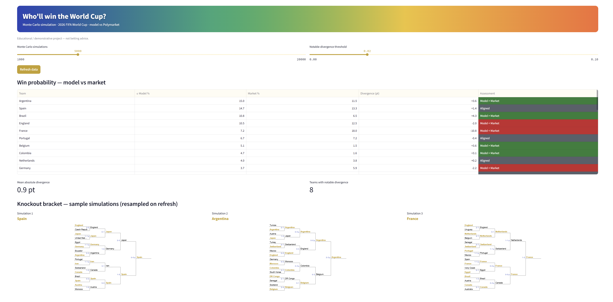
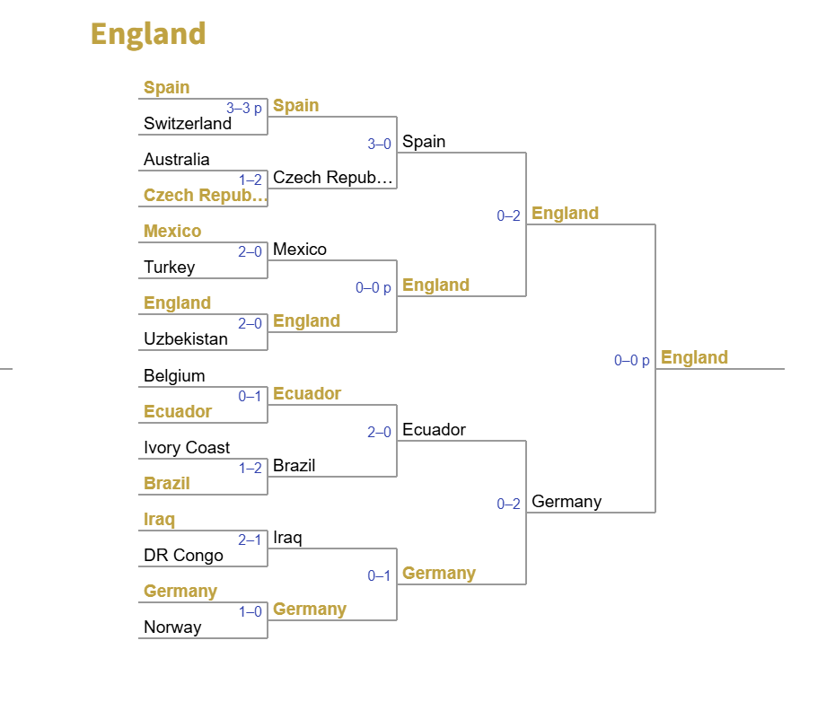

# WC2026 — Market Efficiency Engine


A quantitative study of **prediction-market efficiency**. A statistical model
(Monte Carlo + Poisson) estimates each nation's probability of winning the
**2026 FIFA World Cup**, and compares it against **Polymarket**'s implied
probabilities to measure *where and how much* the two disagree.

Built to run on modest hardware: **no deep learning, no LLMs** — just statistics,
NumPy and modular software engineering.

> ⚠️ **Disclaimer** — Educational/demonstrative project (portfolio). **Not
> commercial**, **not** betting or financial advice.
>
> 📊 **Data** — Historical results from
> [martj42/international_results](https://github.com/martj42/international_results),
> **CC0-1.0** (public domain), downloaded at runtime. Elo is computed by us from
> that data (no proprietary sources). Details in [`DATA_SOURCES.md`](DATA_SOURCES.md).

## Demo



## Quickstart

```bash
pip install -r requirements.txt

python -m app.core.run_wc_demo        # simulate the 48-team World Cup
python -m app.analysis.run_demo       # model vs Polymarket divergence
python -m app.analysis.run_backtest   # RPS backtest + hyper-parameter tuning
python -m app.analysis.run_calibration  # reliability diagram (calibration)
pytest -q
```

With Docker (API + dashboard):

```bash
docker compose up --build
# API + OpenAPI docs: http://localhost:8000/docs
# Dashboard:          http://localhost:8501
```

## How it works

The pipeline is `CC0 results → Elo → attack/defense ratings → 48-team tournament
→ market comparison`. Key design choices:

- **Goal model** — goals follow a Poisson distribution; expected goals
  `λ = base × attack_i × defense_j` (multipliers around 1.0).
- **Ratings** (`ratings.py`) — attack/defense fit by Poisson maximum likelihood
  (iterative scaling, NumPy only), with an exponential **time-decay**
  (half-life **4 years**, the RPS-optimal value from the backtest).
- **Dixon-Coles** (`dixon_coles.py`) — `ρ` correction for the low-score draw
  bias; estimated by grid-search MLE.
- **Elo** (`elo.py`) — a FIFA-style strength rating computed from the same CC0
  results (margin of victory + match importance). Usable as a shrinkage prior.
- **Tournament** (`tournament.py`) — official **2026 group draw**, 12 groups,
  best-third qualification, single-elimination bracket, 10k+ Monte Carlo runs.
  **Host advantage** for USA / Canada / Mexico: ~1.2× expected goals
  (≈ +0.2 goals).
- **Market** (`market/polymarket.py`) — async Polymarket client; "Yes" prices
  with the vig removed (proportional normalization).
- **Analysis** (`analysis/`) — model-vs-market divergence + a serious evaluation
  suite: **RPS**, Brier, log-loss, **calibration (reliability diagram + ECE)**,
  walk-forward **backtest** with hyper-parameter tuning (no data leakage).

Backend: async **FastAPI** (CPU-bound sim in a threadpool, parallel fetch,
caching). Frontend: **Streamlit** (pure client). Packaged with **Docker**.

## Example bracket

A single simulated knockout run (Round of 16 → Final), winners in gold:



## Key findings (measured, not assumed)

- **Time-decay** helps; the RPS optimum is a long ~4-year half-life (national
  squads change slowly).
- **Dixon-Coles** barely moves RPS on internationals (`ρ ≈ −0.02`) — draws are
  less inflated than in club leagues.
- **Shrinkage / Elo prior** *worsened* out-of-sample RPS, so they're **off by
  default**: improving a ranking's face-validity is not the same as improving
  accuracy. Following the metric over intuition is the whole point.
- The systematic model-vs-market gap on big names (e.g. France) is the study's
  headline: the market reacts to live results the pre-tournament model ignores.

## Stack

Python · NumPy · FastAPI · Streamlit · httpx · matplotlib · pytest · ruff · Docker

## License

MIT (code). Data: CC0-1.0 (martj42). See [`DATA_SOURCES.md`](DATA_SOURCES.md).
